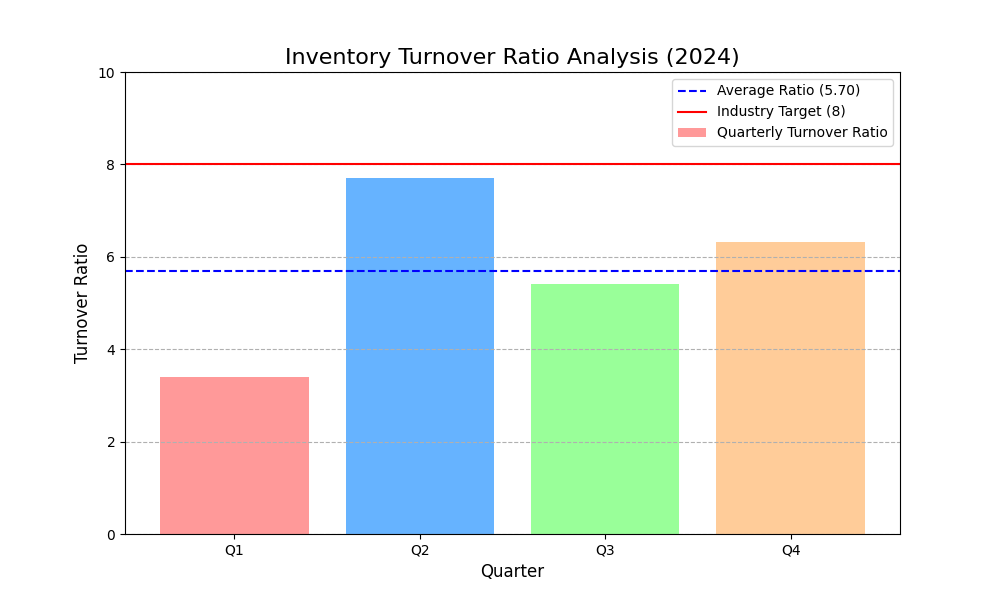

# Retail Performance Analysis: A Data Story on Inventory Turnover Ratio

## Overview

This analysis addresses a concerning trend in our inventory turnover ratio. Our current average of **5.7** falls short of the industry benchmark of **8**, leading to excess inventory and increased storage costs. This report provides a comprehensive data story to illuminate the issue, backed by actionable insights to guide our strategic decision-making for the next fiscal year.

## Quarterly Performance Analysis

The following chart visualizes our 2024 quarterly inventory turnover ratios compared to our average and the industry target:

### Key Findings

*   **Q1 Performance**: The year started with a low turnover ratio of **3.4**, indicating significant overstocking or slow sales.
*   **Q2 Improvement**: Q2 saw a sharp increase to **7.7**, nearing the industry target. This suggests effective inventory management, possibly due to seasonal demand or successful promotions.
*   **Q3 and Q4 Decline**: Performance in Q3 and Q4 declined to **5.41** and **6.31**, respectively. While better than Q1, this indicates a failure to maintain the momentum from Q2.
*   **Overall Average**: The annual average turnover ratio is **5.7**, which is significantly below the industry target of **8**.

## Business Implications

The current trend has several negative business implications:

*   **Increased Holding Costs**: Excess inventory ties up capital and increases storage, insurance, and obsolescence costs.
*   **Reduced Profitability**: Inefficient inventory management directly impacts our bottom line by eroding profit margins.
*   **Inaccurate Forecasting**: The fluctuating quarterly performance points to inconsistencies in our demand forecasting and supply chain operations.

## Recommendations

To address these challenges and reach our target of **8**, we recommend the following:

1.  **Optimize Supply Chain and Demand Forecasting**: This is the core solution. We must invest in advanced analytics and forecasting tools to better predict consumer demand and align our inventory levels accordingly.
2.  **Implement a Dynamic Inventory Strategy**: Adopt a more agile approach to inventory management. This includes adjusting stock levels based on seasonality, market trends, and promotional activities.
3.  **Strengthen Supplier Collaboration**: Work more closely with our suppliers to improve lead times, reduce order sizes, and enhance overall supply chain efficiency.
4.  **Enhance Data Analytics Capabilities**: Leverage data to identify slow-moving products, optimize pricing strategies, and improve product lifecycle management.

## Contact

For further inquiries, please contact: [25ds2000003@ds.study.iitm.ac.in](mailto:25ds2000003@ds.study.iitm.ac.in)
